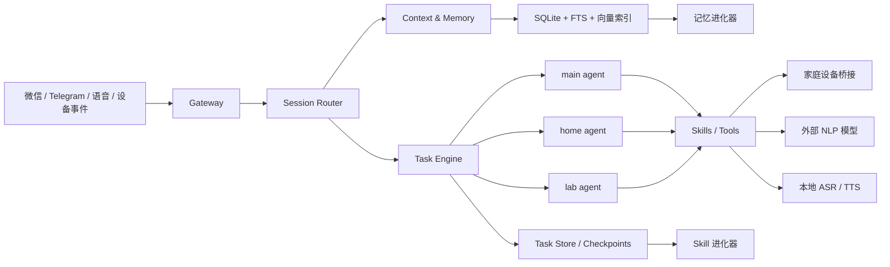

# 淘气包总体设计 V2

更新时间：2026-04-23

## 1. 设计目标

淘气包不是再做一个“大而全的 OpenClaw”或“单体版 Hermes”，而是做一个适合家庭场景、可长期进化、能在轻硬件上运行的家庭智能体中枢。

当前固定约束：

- 运行环境：Linux
- 部署方式：`npm` 为主，参考 OpenClaw 的可自托管方式
- 通道只保留：个人微信、Telegram
- 模型策略：NLP 大模型外接；ASR / TTS 优先支持本地
- 多 agent：至少支持 `main`、`home`、`lab`
- 长期目标：接入家庭摄像头、智能灯、家庭设备、`D:` 盘 AI 玩具项目
- 核心体验：陪伴成长，而不是一次性问答机器人

## 2. 吸收哪些源码能力

### 2.1 来自 OpenClaw

重点吸收：

- 多 agent 路由与隔离
- 通道账号与绑定关系
- 每个 agent 独立 workspace / state / sessions
- 网关统一管理会话、路由、设备/通道接入
- 预压缩前的 memory flush 思路

明确不继承：

- 大量无关通道矩阵
- 重 UI / 重移动端节点 / 大而全插件面
- 过度面向“通用消息平台”的复杂度

对应源码证据：

- `_sources/openclaw/docs/index.md`
- `_sources/openclaw/docs/concepts/multi-agent.md`
- `_sources/openclaw/docs/pi.md`
- `_sources/openclaw/extensions/memory-core/src/flush-plan.ts`

### 2.2 来自 Hermes

重点吸收：

- SQLite + FTS5 的会话持久化与检索
- 会话 lineage、标题、检索、跨来源 source tagging
- Prompt 组装时整合人格、用户信息、记忆、技能
- 插件化 memory provider / context engine
- Gateway / cron / CLI 统一共享同一套 agent runtime

明确不继承：

- 单 active memory provider 的硬限制
- 单大 agent 主循环把所有职责堆在一起
- 工具/平台面过宽导致的重量级运行时

对应源码证据：

- `_sources/hermes-agent/website/docs/developer-guide/architecture.md`
- `_sources/hermes-agent/website/docs/developer-guide/session-storage.md`
- `_sources/hermes-agent/website/docs/developer-guide/memory-provider-plugin.md`

### 2.3 来自 claw-code

重点吸收：

- 轻量高性能 runtime 思路
- `TaskPacket` 的任务边界、验收条件、汇报契约
- `TaskRegistry` 的任务状态机
- session resume / compact / fork
- 权限系统和工具执行前的强约束

明确不继承：

- 以纯 CLI 编码代理为中心的产品边界
- 对家庭设备/消息网关不敏感的执行模型

对应源码证据：

- `_sources/claw-code/rust/README.md`
- `_sources/claw-code/rust/crates/runtime/src/task_packet.rs`
- `_sources/claw-code/rust/crates/runtime/src/task_registry.rs`
- `_sources/claw-code/rust/crates/runtime/src/session.rs`
- `_sources/claw-code/rust/crates/runtime/src/permissions.rs`

## 3. 淘气包的产品定义

淘气包是一个“家庭智能体操作系统”，不是单聊天 bot。

它有四层职责：

1. 通道层：接住微信、Telegram、语音、后续摄像头/设备事件
2. 路由层：判断是谁、在哪个家庭、该交给哪个 agent、是否需要任务化
3. 执行层：把请求拆成任务，调用技能、工具、设备、外部模型和本地模型
4. 记忆与进化层：把长期有价值的信息沉淀为家庭记忆、用户记忆、技能和策略

## 4. 总体架构



## 5. 运行时拆分

为了兼顾轻量和可进化，淘气包采用“Node 控制面 + 可选 sidecar”的结构。

### 5.1 必选核心服务

全部可通过 `npm` 安装和启动：

- `openpeach-gateway`
  - 微信 / Telegram 接入
  - Webhook / polling / 消息标准化
- `openpeach-router`
  - 会话归属
  - 用户识别
  - agent 选择
  - 任务化判定
- `openpeach-runtime`
  - prompt 组装
  - tool / skill 调度
  - agent run loop
- `openpeach-task-engine`
  - 任务状态机
  - 队列
  - checkpoint
  - retry / resume
- `openpeach-store`
  - SQLite
  - FTS5
  - 向量索引
  - 文件资产

### 5.2 可选 sidecar

- `openpeach-asr-local`
  - 本地语音转文字
- `openpeach-tts-local`
  - 本地中文语音播报
- `openpeach-device-bridge`
  - 智能灯、摄像头、Home Assistant、MQTT
- `openpeach-lab-worker`
  - `D:` 盘 AI 玩具项目的运行代理

原则：

- 没 sidecar 也能跑文字版家庭助理
- 需要语音或设备时再按需加载
- 弱硬件默认只跑核心服务 + SQLite

### 5.3 OpenClaw 式运行时工作目录

淘气包不能只把 agent 配置写在代码仓库里。参考 OpenClaw 的 agent workspace 思路，淘气包需要区分“仓库模板”和“真实运行时工作目录”。

仓库内的 `.openpeach/` 只放默认模板，例如：

```text
.openpeach/
  agents/
    main/agent.md
    home/agent.md
    lab/agent.md
  users/
    owner/user.md
  model.runtime.example.toml
```

Linux 运行时的真实工作目录放在用户或服务账号 home 下：

```text
~/.openpeach/families/main/
  README.md
  agents/
    main/
      agent.md
      workspace/
      state/
      sessions/
      artifacts/
      skills/
    home/
      agent.md
      workspace/
      state/
      sessions/
      artifacts/
      skills/
    lab/
      agent.md
      workspace/
      state/
      sessions/
      artifacts/
      skills/
  users/
    owner/user.md
  household/
  memory/
    private/
    shared/
    device/
    project/
    restricted/
  tasks/
  outbox/
  logs/
```

关键规则：

- `.openpeach/agents/*/agent.md` 是仓库模板，不是运行时真实人格。
- `~/.openpeach/families/<family_id>/agents/*/agent.md` 才是运行时真实 agent 配置。
- installer 或首次启动只在目标文件不存在时复制模板，不能覆盖用户已经调过的人格文件。
- 旧的 `~/.openpeach/state.db` 可作为 Phase 0 兼容路径，但长期应迁移到 `~/.openpeach/families/main/state.db` 或等价 workspace 内路径。
- `AGENTS.md` 是给开发者/编码 agent 看的工程准则，不是淘气包运行时人格文件。

## 6. Agent 体系

### 6.1 `main`

家庭总入口。

职责：

- 接住大部分家庭成员请求
- 做会话编排、任务拆解、总结回复
- 调用其他 agent
- 负责“陪伴型人格”和长期关系维护

### 6.2 `home`

家庭环境与设备代理。

职责：

- 智能灯 / 摄像头 / 自动化设备
- 家庭状态、规则、告警
- 低风险场景的自动执行
- 设备联动和家庭日程提醒

### 6.3 `lab`

实验与扩展代理。

职责：

- `D:` 盘 AI 玩具项目
- 新技能灰度验证
- 新模型 / 新工作流试验
- 失败隔离，避免污染主家庭环境

### 6.4 Agent 隔离规则

吸收 OpenClaw 的隔离理念，但做家庭化收缩：

- 每个 agent 有独立 `workspace`
- 每个 agent 有独立 `agent_state`
- 每个 agent 有独立 `session lane`
- 共享同一个“家庭记忆图谱”，但读取范围可控
- `lab` 默认不能直接写入正式家庭自动化规则

### 6.5 Agent 配置文件

每个长期核心 agent 都要有自己的 `agent.md`，用于描述身份、职责、边界、可见记忆域和语气。运行时 prompt 不应该长期写死在 TypeScript 里。

第一版文件约定：

```text
~/.openpeach/families/main/agents/main/agent.md
~/.openpeach/families/main/agents/home/agent.md
~/.openpeach/families/main/agents/lab/agent.md
~/.openpeach/families/main/users/owner/user.md
```

加载顺序建议：

1. 读取全局工程/安全约束。
2. 读取当前 core agent 的 `agent.md`。
3. 根据身份权限读取对应 `user.md` 或 household profile。
4. 读取会话摘要、相关记忆和任务上下文。
5. 拼装最终 system prompt 与 turn prompt。

`user.md` 不等于长期记忆库。它只保存稳定画像和偏好入口；可检索、可审计、可降级的事实仍然要进入 SQLite 记忆表和 memory candidate 机制。

## 7. 通道与多用户模型

这是淘气包必须强于 Hermes 的地方。

### 7.1 只保留两个正式通道

- 微信
- Telegram

不再维护 Discord / Slack / Teams / Matrix 那种大通道矩阵。

补充约束：

- Telegram 作为稳定正式通道
- 个人微信接入必须通过独立 `channel-wechat` 适配层封装，不让上层 runtime 绑定某个具体桥接实现
- 任意微信桥接方案都视为“可替换驱动”，避免后面因为封号、协议变化把主系统拖死

### 7.2 多人接入设计

一个家庭会有多个成员，每个成员可能从多个聊天入口接入。

核心对象：

- `home_id`
- `person_id`
- `channel`
- `account_id`
- `peer_id`
- `thread_id`
- `agent_lane`

会话主键建议：

`home_id + channel + account_id + peer_id + thread_id + agent_lane`

这意味着：

- 同一家庭里，妈妈、孩子、爸爸可以分别有长期上下文
- 同一个人从微信和 Telegram 过来，也可以做身份映射
- 同一个人针对 `main` 和 `lab` 可以有不同对话 lane

### 7.3 微信 / TG 映射策略

- 微信优先绑定到 `person_id`
- Telegram 账号也绑定到 `person_id`
- 如果未绑定，则先进入“待识别访客态”
- 家庭管理员可做账号归属确认

## 8. 会话管理设计

这里直接吸收 Hermes 的 SQLite + FTS5 优点，并补 OpenClaw 的 lane/route 思路。

### 8.1 会话存储

主存储：

- `sessions`
- `messages`
- `messages_fts`
- `session_branches`
- `session_checkpoints`
- `task_links`

其中：

- `sessions` 记录会话元信息、来源、所属人、所属 agent
- `messages` 保存完整消息和工具调用结果
- `messages_fts` 做关键词检索
- `session_branches` 记录压缩、总结、分叉后的 lineage
- `session_checkpoints` 保存恢复点
- `task_links` 建立会话和任务的双向关系

### 8.2 会话检索

淘气包保留 Hermes 的“会话检索能力”，但扩成三层：

1. 关键词检索
2. 语义检索
3. 结构化过滤

过滤维度：

- 某个家庭成员
- 某个 agent
- 某个设备
- 某个房间
- 某个时间段
- 某个主题

### 8.3 会话压缩与恢复

吸收 Hermes / claw-code / OpenClaw 的共性：

- 长会话会自动压缩
- 压缩前先做 memory flush
- 压缩后保留可追溯 lineage
- 所有任务型对话都要有 checkpoint
- 中断后可从上一个 checkpoint 恢复，而不是整段重做

## 9. 任务执行引擎

这是淘气包必须显著优于 OpenClaw 的部分。

### 9.1 基本思路

所有“非即时聊天”都进入任务引擎，不直接让 agent 在长对话里硬扛。

任务分三类：

- 即时任务
  - 例如“把客厅灯关掉”
- 编排任务
  - 例如“帮我规划孩子明天早上的出门提醒”
- 长任务
  - 例如“去 D 盘跑 AI 玩具项目，整理结果后告诉我”

### 9.2 TaskPacket

吸收 claw-code 的 `TaskPacket` 思路，淘气包每个任务都必须结构化：

- `objective`
- `task_type`
- `scope`
- `home_scope`
- `person_scope`
- `agent_owner`
- `input_context`
- `acceptance_checks`
- `risk_level`
- `approval_policy`
- `reporting_contract`
- `escalation_policy`
- `checkpoint_policy`

这样做的目的：

- 不让 agent 直接在“自然语言糊团”里开跑
- 便于恢复、重试、审计、回放
- 便于未来 skill 自进化从任务轨迹提炼模板

### 9.3 任务状态机

建议状态：

- `created`
- `ready`
- `running`
- `waiting_tool`
- `waiting_external`
- `waiting_approval`
- `paused`
- `completed`
- `failed`
- `cancelled`

### 9.4 执行策略

默认策略不是“单 agent 持续自主长跑”，而是：

1. 路由层判断是否需要任务化
2. 任务引擎创建 `TaskPacket`
3. 选择 owner agent
4. 选择 skill / tool plan
5. 按 step 执行
6. 每步写 checkpoint
7. 失败按策略 retry / escalate / ask human

### 9.5 为什么这样更高效

相比 OpenClaw 里较重的会话驱动执行，淘气包把“聊天”与“执行”拆开：

- 对话上下文不必一直背着长任务跑
- 长任务可以暂停和恢复
- 可并发多个家庭任务
- 更容易控制资源
- 更适合轻硬件

## 10. 记忆系统

淘气包记忆不是一个文件，而是四层结构。

### 10.1 记忆分层

- `profile memory`
  - 家庭成员偏好、称呼、禁忌、习惯
- `home memory`
  - 房间、设备、作息、家庭规则
- `task memory`
  - 某类任务的已知做法、常见失败、最佳步骤
- `episodic memory`
  - 具体事件、具体对话、具体任务轨迹

### 10.2 存储形式

- SQLite 结构化表
- `memory/YYYY-MM-DD.md` 这类按日沉淀文件
- 向量索引用于语义召回

### 10.3 Memory Flush

吸收 OpenClaw 的 compaction 前 flush 思想：

- 会话压缩前先抽取“值得长期保留”的内容
- 只追加，不覆盖
- 原始人格/规则文件只读

## 11. 记忆自进化

记忆自进化不是“模型自己瞎改记忆”，而是一个受约束的提炼流水线。

### 11.1 输入

- 会话消息
- 任务轨迹
- 设备事件
- 用户显式反馈
- 失败/回滚记录

### 11.2 流水线

1. `capture`
   - 把候选记忆抽出来
2. `score`
   - 判断是否长期有效
3. `dedupe`
   - 和已有记忆去重 / 合并
4. `classify`
   - 归类到人、家庭、设备、任务、技能
5. `promote`
   - 写入正式记忆层
6. `review`
   - 对高风险改动等待人工确认

### 11.3 评分维度

- 是否重复出现
- 是否跨会话复用
- 是否带来更高命中率
- 是否被用户明确确认
- 是否和现有记忆冲突

### 11.4 冲突处理

不直接覆盖旧记忆，而是：

- 保留版本
- 标记来源
- 记录置信度
- 新旧并存直到被验证

## 12. Skill 自进化

Skill 自进化的目标不是无限生成 skill，而是把“稳定成功的做事套路”沉淀成可复用执行单元。

### 12.1 Skill 候选来源

- 反复成功的任务轨迹
- 某类设备联动的稳定工作流
- 某类家庭提醒 / 陪伴流程
- `lab` agent 试验成功后回灌

### 12.2 进化流水线

1. `trace capture`
   - 抓取完整成功轨迹
2. `pattern mining`
   - 找出高频步骤和输入条件
3. `skill draft`
   - 生成技能草案
4. `replay test`
   - 在沙箱 / 回放数据上验证
5. `score`
   - 成功率、耗时、风险、可解释性
6. `publish`
   - 进入 skill registry
7. `observe`
   - 在线监控命中率和回退率

### 12.3 Skill 分级

- `draft`
- `shadow`
- `active`
- `deprecated`
- `blocked`

### 12.4 为什么比 Hermes 更适合淘气包

Hermes 的 skill / plugin 更偏“人工安装与手工组织”。

淘气包需要的是：

- 家庭任务自举
- 技能版本化
- 灰度发布
- `lab -> home/main` 的回灌通道

## 13. 模型与语音策略

### 13.1 NLP

- 以外部大模型为主
- 支持多 provider fallback
- 家庭任务与长任务可分模型档位

### 13.2 ASR

本地优先，候选实现可后续再定：

- `whisper.cpp`
- `faster-whisper`
- `FunASR`

### 13.3 TTS

本地优先，候选实现可后续再定：

- `Piper`
- `CosyVoice`
- 其他可本地化中文 TTS

### 13.4 选择原则

- 文字主链路必须先跑通
- 语音是增强层，不绑死主系统
- 本地语音服务失效时，核心网关仍可继续工作

## 14. 设备与家庭场景

### 14.1 第一阶段设备对象

- 智能灯
- 摄像头事件
- Home Assistant / MQTT 事件
- 家庭日历 / 提醒
- `lab` 对外暴露的 AI 玩具项目能力

### 14.2 设备接入原则

- 先做“事件读 + 指令写”
- 再做自动化编排
- 最后才做自治规则学习

路径约束：

- 你当前开发机上的 `D:` 盘项目，在 Linux 部署时不能保留盘符语义
- 淘气包内部统一记录为 `lab mount`，例如 `/srv/openpeach/lab-projects/ai-toys`
- `lab` agent 只认逻辑挂载名和 Linux 实际路径映射

### 14.3 安全分层

- 读设备状态：低风险
- 改灯光 / 提醒：中风险
- 摄像头主动分析 / 外发通知：高风险
- 涉及儿童、家庭隐私的动作默认需审批

## 15. 存储选型

默认轻量方案：

- 主库：SQLite
- 检索：FTS5
- 向量：SQLite 扩展或独立轻量向量库
- 文件：本地文件系统

升级路径：

- 单机阶段：SQLite 足够
- 家庭规模扩大或多节点同步时：Postgres + pgvector

## 16. Linux + npm 部署方案

仓库形态建议采用 npm workspace：

```text
openpeach/
  apps/
    gateway/
    api/
    console/
  packages/
    core/
    router/
    runtime/
    task-engine/
    memory/
    skill-registry/
    channel-wechat/
    channel-telegram/
    device-bridge/
    model-adapters/
  services/
    asr-local/
    tts-local/
    lab-worker/
```

部署方式：

- `npm install`
- `npm run build`
- `npm run start:gateway`
- `systemd` 托管常驻服务

安装初始化还必须做一件事：创建 OpenClaw 式 runtime workspace。

```text
install-openpeach
-> 确认 OPENPEACH_HOME，默认 ~/.openpeach
-> 创建 families/main 目录树
-> 从仓库 .openpeach/agents 复制 agent.md 模板
-> 从仓库 .openpeach/users 复制 user.md 模板
-> 若目标文件已存在则保留用户本地版本
-> 写入或迁移 state.db / logs / tasks / outbox 路径
```

这样仓库升级不会覆盖运行时人格，用户也能像 OpenClaw 一样直接进入工作目录查看和调整 agent 配置。

优点：

- 与 OpenClaw 的部署习惯接近
- 对 Linux 服务器友好
- 主系统不依赖 Python 才能启动
- Python / Rust 只作为可选 sidecar

## 17. 与现有项目的差异总结

### 相比 OpenClaw

- 通道大幅收缩，只保留微信 / TG
- 任务执行从“会话驱动”改成“任务引擎驱动”
- 记忆不只做 transcript recall，而是做家庭记忆分层
- 更面向家庭设备和陪伴，而不是通用聊天网关

### 相比 Hermes

- 从单 agent 心智升级为多 agent 协作
- 保留会话检索，但把多用户家庭身份映射做深
- 记忆 provider 不再单选，改成分层记忆总线
- skill 不只安装和调用，还要支持灰度进化

### 相比 claw-code

- 不只做本地 CLI 执行器
- 把任务包、权限、resume 思路放进家庭 runtime
- 执行目标从代码任务扩到家庭任务 / 设备任务 / 实验任务

## 18. 推荐实施顺序

### Phase 0

先做最小闭环：

- Telegram 接入
- 单家庭
- `main` agent
- SQLite 会话存储
- 基础任务执行
- 外部 NLP

### Phase 1

- 微信接入
- 多用户身份映射
- `home` agent
- 会话检索
- 记忆分层

### Phase 2

- 本地 ASR / TTS
- 家庭设备桥接
- `lab` agent
- 任务 checkpoint / resume

### Phase 3

- 记忆自进化
- skill 自进化
- 家庭规则引擎
- 摄像头事件理解

## 19. 当前结论

淘气包最合理的落点不是“OpenClaw + Hermes 的拼盘”，而是：

- 用 OpenClaw 的网关与多 agent 隔离
- 用 Hermes 的会话检索与存储
- 用 claw-code 的轻量任务执行与 resume 思想
- 再围绕家庭场景重做一层任务、记忆、技能进化系统

这版设计的核心判断只有一句话：

**淘气包应该以“家庭任务操作系统”为中心，而不是以“单轮聊天代理”或“通用全通道网关”为中心。**

## 20. 对话决策追踪与补漏清单

这一节专门用于防止 Veo 视频制作对话插入太长后，把前面已经定下来的淘气包设计结论冲散。

### 20.1 已经明确纳入的对话决策

| 对话结论 | 文档落点 |
| --- | --- |
| 跑在 Linux，不是 Windows | 第 1 章、第 16 章 |
| 参考 OpenClaw，使用 npm 部署 | 第 16 章 |
| 通道收缩，只保留个人微信和 Telegram | 第 7 章 |
| 支持多个 agent，而不是 Hermes 那种单 agent 限制 | 第 6 章 |
| 初始 agent 为 `main` / `home` / `lab` | 第 6 章 |
| NLP 模型外接 | 第 13.1 节 |
| ASR / TTS 优先考虑本地 | 第 13.2、13.3 节 |
| 目标是家庭智能体中枢 | 第 3 章、第 4 章 |
| 后续接入摄像头、智能灯、AI 玩具项目 | 第 14 章 |
| 需要多人微信 / Telegram 接入 | 第 7.2、7.3 节 |
| 需要会话管理，并保留 Hermes 的会话检索能力 | 第 8 章 |
| 需要任务执行设计，不能沿用 OpenClaw 低效长会话执行 | 第 9 章 |
| 任务执行可参考 claw-code | 第 2.3 章、第 9 章 |
| 需要记忆自进化 | 第 11 章 |
| 需要 skill 自进化 | 第 12 章 |

### 20.2 需要补得更细的设计点

这些点在 V2 文档里已经有入口，但还不够工程化，后续应该单独拆文档。

#### Hermes 自我进化闭环

Hermes 的“自我进化”不能只理解为记忆存储，而应拆成完整闭环：

1. 执行复杂任务
2. 记录轨迹、工具调用、失败点和验证结果
3. 会话结束或任务结束后自动复盘
4. 提炼可复用经验
5. 写入记忆、任务模板或 skill 草案
6. 在后续相似任务中召回
7. 通过成功率、回退率和用户反馈继续更新

淘气包应把这个闭环显式实现为：

- `task retrospective worker`
- `memory evolution worker`
- `skill evolution worker`
- `policy review worker`

#### 会话检索入口

第 8 章已经写了 SQLite + FTS5 + 语义检索，但还缺“产品入口”：

- `search_sessions(query, filters)`
- `search_family_memory(query, person_id, home_id)`
- `find_similar_tasks(objective, scope)`
- `resume_session(session_id)`
- `explain_recall(memory_id)`

淘气包不应该只让 LLM 内部召回，还要给管理员和未来 Web 控制台提供可见检索。

#### 多人家庭权限

第 7 章写了多人接入，但还缺家庭角色模型。

建议角色：

- `owner`
- `parent`
- `child`
- `guest`
- `device`
- `agent`

权限差异：

- 儿童默认不能触发高风险设备动作
- 访客只能临时对话，默认不进入长期记忆
- 家庭管理员可确认身份绑定、删除记忆、审批设备规则
- 设备事件只作为输入，不自动拥有执行权限

#### 任务执行细分角色

第 9 章已经定义任务引擎，但还应进一步拆成：

- `planner`
  - 把自然语言转成 TaskPacket
- `dispatcher`
  - 选择 agent / skill / tool
- `executor`
  - 执行 step
- `verifier`
  - 跑验收检查
- `reviewer`
  - 总结结果和风险
- `checkpoint manager`
  - 保存断点和恢复状态

这能解决 OpenClaw 那种“任务在长会话里越跑越重”的问题。

#### Skill 自进化的文章启发

之前提到的 skill 自进化文章，核心不应只落成“生成 skill 文档”，而应吸收这几个思想：

- Skill 不是普通工具调用，而是包含工作流说明、脚本、参考资料和适用条件的结构化包
- 好 skill 来自真实任务轨迹，而不是凭空手写
- 自进化流程必须有 replay test，不能生成后直接上线
- skill 应该有质量分、风险分、适用场景和版本
- 低置信 skill 先进入 `shadow`，只观察不自动执行
- `lab` agent 是 skill 进化的试验田，成功后再发布给 `home` / `main`

#### 家庭陪伴成长

“陪伴成长”不只是记忆越来越多，还应有可衡量的成长目标：

- 更懂家庭成员偏好
- 更少重复问同样问题
- 更准确识别场景
- 更少误触发设备
- 更自然地延续长期话题
- 能解释“为什么我这样回应你”

### 20.3 明确不做或暂缓的点

- 暂缓做全通道矩阵，只保留个人微信和 Telegram
- 暂缓做复杂 Web 控制台，先用 CLI/API 管理
- 暂缓把所有模型本地化，NLP 先外接
- 暂缓摄像头主动识别，先接事件和手动触发
- 暂缓自动修改家庭规则，高风险规则必须审批
- 暂缓让 skill 自动上线，必须经过 replay / shadow / approval

### 20.4 待用户补充确认的点

- 个人微信准备用哪类桥接方式：协议库、网页版桥接、手机转发、还是第三方服务
- Linux 目标硬件：树莓派、N100 小主机、NAS、还是普通服务器
- AI 玩具项目在 Linux 下的最终挂载路径
- 本地 ASR / TTS 更看重低资源占用还是中文效果
- 家庭成员权限里是否需要儿童专用模式
- 是否需要一个极简 Web 控制台查看会话、记忆、任务和设备状态

## 21. 对话对齐补丁：Veo 插曲前已经定下的细节

这一节来自用户补贴的历史对话，用来补齐 V2 文档中写得不够明确的部分。这里的内容优先级高于前文的泛化表述。

### 21.1 路线 C 已定稿

淘气包采用路线 C：

**外部少量核心 agent + 内部 Hermes 式子 agent。**

更具体地说：

- 外部像 OpenClaw
  - 有少量长期核心 agent
  - 有独立 persona、workspace、权限边界、路由规则
  - 支持多用户、多通道、多场景的逻辑隔离
- 内部像 Hermes
  - 统一 SQLite + FTS5 状态内核
  - 支持 delegate / subagent 临时委派
  - 支持 session_search、memory manager、skill_manage 风格的自进化闭环
- 任务执行吸收 claw-code
  - typed TaskPacket
  - Task 与 Worker 分离
  - typed event
  - 机器可读状态面

一句话定稿：

**外部像团队，内部像一个会成长的大脑。**

### 21.2 核心 agent 数量的收敛

历史对话里出现过 4 个外部角色：

- 消息助理
- 家庭设备管家
- AI 玩具助手
- 总控调度官

后续已经收敛为 MVP 先做 3 个核心 agent：

- `main`
- `home`
- `lab`

两者不是冲突，而是映射关系不同：

- `main` 承担“消息助理 + 总控调度官”的职责
- `home` 承担“家庭设备管家”的职责
- `lab` 承担“AI 玩具助手 + 进化工坊”的职责

后续如果 `main` 过重，再把 `orchestrator` 从 `main` 中拆出来。

### 21.3 会话底座采用 C：逻辑隔离，物理统一

会话和持久化也已经选择 C：

**逻辑上像 OpenClaw，物理落库像 Hermes。**

这意味着：

- 外部核心 agent 有清晰 session 边界
- 多人、多通道、多场景不串会话
- 底层仍进入统一 SQLite + FTS5 + transcript artifacts
- 检索可以跨 agent、跨任务、跨历史，但要受权限域控制

### 21.4 会话拆成两层

淘气包的会话必须拆成两层：

1. `logical_session`
   - 面向外部核心 agent
   - 用来表达“这是哪个人、哪个场景、哪个 agent 的会话”
2. `physical_transcript`
   - 底层真实事件流和消息流
   - 进入统一数据库和 artifact 存储

这样外部看起来有多个 agent 和多个会话，底层仍能统一检索和回放。

### 21.5 Session Key 需要保留场景和范围

会话 key 不只是 `person + channel`，还必须包含 agent、scene、thread、scope 等维度。

建议格式：

```text
family:<family_id>/agent:<core_agent_id>/channel:<channel>/account:<account_id>/peer:<peer_id>/scene:<scene>/thread:<thread_id>
```

典型例子：

```text
family:main/agent:lab/channel:wechat/account:personal/peer:child01/scene:bedtime
family:main/agent:home/channel:tg/account:main/peer:owner/scene:device-debug/thread:lamp-issue
```

这样可以避免：

- bedtime 陪伴会话污染设备调试会话
- AI 玩具项目会话污染家庭设备会话
- 多人私聊之间串上下文
- 同一个人在不同场景下被错误合并

### 21.6 会话、记忆、Skill 三者必须分开

这是对话里已经定死的原则：

- `session` 保存“发生过什么”
- `memory` 保存“沉淀出什么”
- `skill` 保存“以后怎么做”

因此：

- 会话库要可检索、可回放
- 记忆库要可晋升、可降级、可回滚
- skill 库要可版本化、可灰度、可测试

不能把会话摘要直接当长期记忆，也不能把成功过一次的流程直接当正式 skill。

### 21.7 多人接入的四层身份模型

多人微信 / Telegram 接入必须按四层身份建模：

- `channel_identity`
  - 某个微信联系人、微信群、Telegram 用户、Telegram 群、topic
- `person_identity`
  - 真实的人
- `household_identity`
  - 家庭单元
- `role_identity`
  - owner、adult_member、child_member、guest、admin_like_operator

默认规则：

- 私聊默认 `per-account-channel-peer`
- 群聊默认 `shared_group_session + per-person attribution`
- Telegram topic 默认 `shared_thread_session`
- 跨微信 / TG 的同一人绑定必须显式确认，不自动猜
- 原始会话不强行合并，长期个人记忆可以在同一 `person_id` 下共享

### 21.8 记忆域必须按权限拆分

多人接入后，记忆至少拆成这些域：

- `private_person_memory`
- `household_shared_memory`
- `group_memory`
- `device_memory`
- `project_memory`
- `restricted_memory`

核心 agent 可见范围：

- `main`
  - 当前用户 private memory + household shared memory
  - 默认不能读其他人的 private memory
- `home`
  - device memory + household shared memory + 当前请求必要的人物信息
  - 默认不读私人聊天长期记忆
- `lab`
  - project memory + skill candidate/imported library + 明确授权材料
  - 默认不读家庭私聊记忆

### 21.9 通道与设备必须分层

微信 / Telegram 是“人类通道”。

摄像头、智能灯、Home Assistant、AI 玩具、本地语音不是聊天通道，而是能力适配器。

淘气包内部应该拆成：

- `HumanEnvelope`
  - 来自微信 / Telegram
  - 字段包括 channel、account、person、peer、group、thread、message、media、reply_ref、capability_flags
- `DeviceAdapter`
  - 来自家庭设备和项目系统
  - 统一四类接口：`event_in`、`command_out`、`state_snapshot`、`capability_describe`

第一批适配器：

- `telegram-adapter`
- `wechat-adapter`
- `homeassistant-bridge`
- `camera-event-bridge`
- `toy-bridge`
- `voice-sidecar`

设备事件默认先进入 `device_event` / `device_memory`，只有满足规则的高优先级事件才升级为给人类通道的通知。

### 21.10 双模式委派

任务委派分两类：

- 同步委派
  - Hermes 风格
  - 当前回复里等待结果
  - 适合检索、对比、小分析、状态判断
- 异步后台任务
  - OpenClaw 风格
  - 先告诉用户“已经开始处理”，后台完成后再回推
  - 适合 GitHub 吸收、长代码分析、摄像头历史分析、设备巡检、夜间进化

这解决的是：

- Hermes 当前回复连贯
- OpenClaw 长任务不阻塞
- 淘气包在轻硬件上避免所有事都重 agent 化

### 21.11 轻量调度 lane

调度器不用一开始上重型队列系统，先用 SQLite 队列表。

建议四条 lane：

- `P0 interactive`
  - 微信 / Telegram 当前对话
- `P1 device-control`
  - 家庭设备控制与告警
- `P2 worker`
  - 分析、检索、验证子任务
- `P3 evolution`
  - 记忆整理、skill 提炼、GitHub 吸收

默认资源限制：

- 主交互并发：1
- worker 并发：2
- evolution 并发：1
- 单次 orchestrator fan-out 不超过 3

锁：

- `session_lock`
- `device_lock`
- `agent_lock`

### 21.12 Task 与 Worker 必须分离

这是从 claw-code 吸收后补上的关键设计。

`Task` 表示“这件事是什么”。

`Worker` 表示“谁在执行、执行到哪、是否卡住、能不能恢复”。

一个 Task 可以：

- 没有独立 Worker
- 借一个短生命周期 Worker
- 绑定一个持久 Worker
- 作为 Flow 的一部分串联多个子 Task

### 21.13 家庭化 TaskPacket 字段

不照抄 claw-code 的 repo/worktree/commit 字段，而是改成家庭场景字段：

- `objective`
- `scope_kind`
  - conversation、device、project、family、custom
- `scope_ref`
- `source_session_key`
- `requester_identity`
- `target_agent`
- `priority`
- `execution_mode`
  - turn、microtask、job、flow
- `acceptance_contract`
- `reporting_contract`
- `escalation_policy`
- `resource_locks`
- `budget`
- `memory_policy`

### 21.14 TaskStatus 与 WorkerStatus 分离

`TaskStatus`：

- `created`
- `admitted`
- `queued`
- `running`
- `blocked`
- `awaiting_confirmation`
- `succeeded`
- `failed`
- `cancelled`
- `orphaned`

`WorkerStatus`：

- `spawning`
- `ready`
- `running`
- `blocked`
- `recovering`
- `finished`
- `failed`

这样能区分：

- 任务没失败，只是 worker 卡住
- worker 已恢复，但任务还在等确认
- 任务被策略拒绝，不是执行器崩溃

### 21.15 Typed Event 不能靠日志猜状态

淘气包要有统一事件流，而不是从 agent 回复文本里反推任务状态。

至少包含：

- `task.created`
- `task.queued`
- `task.dispatched`
- `task.blocked`
- `task.awaiting_confirmation`
- `task.retry_scheduled`
- `task.completed`
- `task.failed`
- `worker.ready`
- `worker.prompt_misdelivery`
- `worker.transport_unhealthy`
- `device.command_sent`
- `device.command_acked`
- `approval.requested`
- `approval.resolved`
- `evolution.candidate_created`
- `evolution.promoted`

### 21.16 运行时模块边界

对话里已经定过一张运行时装配图，应在实施时按这个边界拆模块：

```text
Ingress Adapters
Envelope Normalizer
Identity + Policy Resolver
Session Kernel
TaskPacket Builder
Admission Controller
Scheduler + Locks
Turn Executor / MicroTask Runner / Job Runner / Flow Runner
main / home / lab Agent Runtime
Tool / Device / Skill Runtime
Event Bus
Outbox
Memory Kernel
Task Registry
Worker Registry
Evolution Engine
SQLite + Artifacts
```

### 21.17 安全边界必须四层同时做

安全不是一个总开关，而是四层：

- 接入安全
  - 谁能进来
- 会话安全
  - 这次对话能读什么上下文
- 能力安全
  - 这个 agent 能调用什么能力
- 执行安全
  - 动作是否真的发出去

设备能力分级：

- `read`
- `low_risk_control`
- `high_risk_control`

高风险动作必须满足：

- 策略允许
- 当前通道确认通过
- outbox 有记录
- 事件流可审计

### 21.18 故障恢复与 outbox

所有出站动作都必须写 outbox：

- `pending`
- `sent`
- `acked`
- `failed`

设备命令和消息投递都要带 `idempotency_key`，避免重试导致重复开灯、重复发消息、重复触发 AI 玩具动作。

Adapter 状态机：

- `healthy`
- `degraded`
- `paused`

只对瞬时错误重试：

- 网络抖动
- rate limit
- 临时 5xx

不对权限错误、策略错误、目标不存在这类错误盲目重试。

### 21.19 最小可观测指标

运行时至少记录五类事件：

- `message_event`
- `task_event`
- `device_event`
- `approval_event`
- `evolution_event`

最少监控八个指标：

- 通道入站成功率
- 通道出站成功率
- 任务队列深度
- 平均响应时延
- 危险动作审批次数
- 设备控制失败率
- 记忆提取命中率
- skill 提案通过率

### 21.20 MVP 顺序修正

结合这段对话，MVP 不只是“Telegram + SQLite + main”。

Phase 0 应明确包含：

- Telegram 主通道
- `main` agent
- OpenClaw 式 runtime workspace 初始化：`~/.openpeach/families/main/agents/main/agent.md`、`users/owner/user.md`
- `main` agent prompt 从 runtime `agent.md` 加载，TypeScript 内置 prompt 只作为 fallback
- 统一 SQLite state.db
- `logical_session + physical_transcript`
- `HumanEnvelope`
- `TaskPacket Builder`
- `Admission Controller`
- `P0 interactive` lane
- 最小 `TaskRegistry`
- 最小 `Event Bus`
- 外部 NLP provider adapter

Phase 1 再加入：

- 微信适配
- 多人身份绑定
- `home` agent
- `DeviceAdapter`
- `P1 device-control` lane
- outbox / approval

Phase 2 再加入：

- `lab` agent
- `P2 worker` / `P3 evolution`
- AI 玩具项目桥接
- 记忆候选池
- session_search 产品入口

Phase 3 再加入：

- skill 自进化
- replay / shadow / approval
- 摄像头事件理解
- 家庭自动化规则学习

## 22. 正式规格大纲：从 MVP 到长期进化

这一章把前面的架构收束成可以进入实施计划的规格大纲，回答三个问题：

- MVP 第一阶段必须做什么
- 第二阶段摄像头 / 智能灯怎么接入
- 第三阶段 skill 自进化和家庭多成员怎么放开

### 22.1 MVP 第一阶段：能聊天、能记、能检索、能任务化

第一阶段目标不是做全功能家庭中枢，而是跑通最小闭环：

**一个稳定入口，一个主 agent，一个统一会话库，一个最小任务引擎。**

#### 必须支持的用户场景

- 你可以从 Telegram 找到淘气包
- 淘气包能识别这是哪个家庭、哪个用户、哪个会话
- 淘气包能用外部 NLP 模型完成普通对话
- 对话内容会写入 SQLite
- 旧会话可以用关键词检索
- 非简单问答可以被包装成 TaskPacket
- 任务状态和事件可以被查询

#### MVP 范围

| 模块 | MVP 要做 | 不做 |
| --- | --- | --- |
| 通道 | Telegram 私聊 | 微信、群聊、topic 深度支持 |
| Agent | `main` | `home`、`lab` 的完整能力 |
| 会话 | `logical_session + physical_transcript` | 复杂分叉和跨平台身份合并 |
| 存储 | SQLite + FTS5 + artifact 目录 | Postgres、分布式存储 |
| 任务 | TaskPacket、Admission、TaskRegistry | Worker fleet、复杂 Flow |
| 事件 | 最小 EventBus | 完整观测面和图形控制台 |
| 模型 | 外部 NLP provider adapter | 本地 NLP |
| 语音 | 暂不做 | ASR / TTS |

#### MVP 组件清单

```text
apps/gateway
packages/channel-telegram
packages/envelope
packages/identity
packages/session-kernel
packages/store-sqlite
packages/runtime
packages/task-engine
packages/event-bus
packages/model-adapters
```

#### MVP 数据表

最少需要：

- `channel_identities`
- `persons`
- `households`
- `logical_sessions`
- `messages`
- `messages_fts`
- `transcript_artifacts`
- `task_packets`
- `tasks`
- `task_events`
- `outbox`

#### MVP 请求链路

```text
Telegram message
-> HumanEnvelope
-> Identity Resolver
-> Session Kernel
-> main agent
-> optional TaskPacket Builder
-> response
-> message/session/task events
-> Telegram outbox
```

#### MVP 验收标准

- Telegram 私聊能稳定收发
- 同一用户连续对话不会丢上下文
- 不同用户不会串 session
- `search_sessions()` 可以搜到历史消息
- 一个非简单请求会生成 TaskPacket
- Task 状态从 `created` 走到 `succeeded` 或 `failed`
- 所有出站消息先写 outbox，再发送
- 重启服务后仍能恢复 session 和 task 状态

### 22.2 第二阶段：接入家庭设备、摄像头、智能灯

第二阶段目标是让淘气包从“聊天中枢”升级为“家庭中枢”。

核心原则：

**人类通道不等于设备通道。设备走 DeviceAdapter，设备动作走安全门。**

#### 第二阶段新增模块

```text
packages/device-adapter
packages/home-agent
packages/approval
packages/policy
packages/outbox
packages/device-memory
services/device-bridge
```

#### 第一批设备适配

- `homeassistant-bridge`
  - 智能灯、插座、传感器
- `camera-event-bridge`
  - 摄像头事件摘要，不直接长期喂视频流
- `toy-bridge`
  - AI 玩具项目能力接口

#### home agent 职责

- 读取设备状态
- 执行低风险设备动作
- 管理设备事件与家庭规则
- 对高风险动作发起审批
- 维护 `device_memory`

#### 设备动作分级

| 等级 | 例子 | 策略 |
| --- | --- | --- |
| `read` | 查询灯状态、查询传感器 | 可直接执行 |
| `low_risk_control` | 开关灯、播放提示音 | 授权用户可执行 |
| `high_risk_control` | 摄像头持续分析、安防动作、宿主机脚本 | 必须审批 |

#### 摄像头接入原则

- 第一版只接事件，不做持续视频理解
- 事件进入 `device_events`
- 摘要进入 `device_memory`
- 原始媒体只保存 pointer
- 只有用户明确要求时才调取原始媒体

#### 第二阶段请求链路

```text
User asks main
-> main detects device intent
-> TaskPacket(scope_kind=device)
-> Scheduler P1 device-control lane
-> home agent
-> DeviceAdapter command/state
-> approval if needed
-> outbox + event log
-> main summarizes to user
```

#### 第二阶段验收标准

- 可以查询客厅灯状态
- 可以执行低风险灯光控制
- 未授权用户不能控制设备
- 高风险动作会进入 `awaiting_confirmation`
- 摄像头事件能进入事件库
- 设备命令失败不会无限重试
- 重试不会重复执行同一个设备命令
- `home` 不能读取无关私人聊天记忆

### 22.3 第三阶段：放开家庭多成员和 skill 自进化

第三阶段目标是让淘气包真正开始“陪伴成长”。

这里不能一口气全放开，必须先让多成员权限和 skill 灰度机制稳定。

#### 多成员能力

新增：

- 微信适配
- channel identity 绑定
- person identity 合并
- household role
- group session
- private / shared / restricted memory 域

默认规则：

- 私聊隔离
- 群聊共享上下文，但每条消息保留发言者
- 跨微信 / TG 同一人需要显式绑定
- 儿童账号默认不能触发高风险动作
- 访客默认不进入长期记忆

#### skill 自进化能力

新增：

```text
packages/skill-registry
packages/skill-evolution
packages/replay-runner
packages/evaluation
```

skill 生命周期：

- `draft`
- `shadow`
- `active`
- `deprecated`
- `blocked`

skill 晋升条件：

- 来自真实成功任务轨迹
- 有 replay test
- 有适用条件
- 有风险分
- 有回滚路径
- 通过 `lab` 试验
- 高风险 skill 需要审批

#### 自进化闭环

```text
session/task trace
-> retrospective worker
-> memory candidate / skill candidate
-> replay test
-> score
-> shadow mode
-> observe
-> promote or rollback
```

#### 第三阶段验收标准

- 同一家庭多个 Telegram / 微信用户不会串记忆
- owner 可以绑定微信身份和 Telegram 身份到同一 person
- 群聊可以保留群上下文，同时识别发言者
- `lab` 可以从任务轨迹生成 skill candidate
- skill candidate 不会直接进入 active
- replay 失败的 skill 不会发布
- shadow skill 只观察，不自动执行
- 用户可以查看某条记忆或 skill 的来源证据

### 22.4 阶段依赖关系

```text
MVP Phase 0
  -> Session Kernel
  -> TaskPacket
  -> EventBus
  -> Search

Phase 1 Device/Home
  -> DeviceAdapter
  -> home agent
  -> Policy / Approval
  -> Device Memory

Phase 2 Multi-user/Lab
  -> Identity Linking
  -> lab agent
  -> Worker lanes
  -> Memory candidates

Phase 3 Evolution
  -> Skill Registry
  -> Replay Runner
  -> Shadow Mode
  -> Promotion / Rollback
```

### 22.5 不进入前三阶段的能力

这些能力先不做，避免 MVP 失控：

- 全通道平台矩阵
- 完整 Web 控制台
- 长视频/摄像头持续理解
- 自动发布高风险家庭规则
- 本地大模型训练
- 多家庭 SaaS 化
- 复杂分布式队列
- 自动从 GitHub 代码直接上线 skill

### 22.6 进入实施计划前的最终规格结论

淘气包第一版不是“先把所有 agent 做出来”，而是先把底座做对：

- 统一入口
- 统一身份
- 统一会话
- 统一任务
- 统一事件
- 统一 outbox

只要这六个底座稳定，后面接微信、智能灯、摄像头、AI 玩具、skill 自进化，都是往同一套骨架上加能力，而不是推倒重来。
